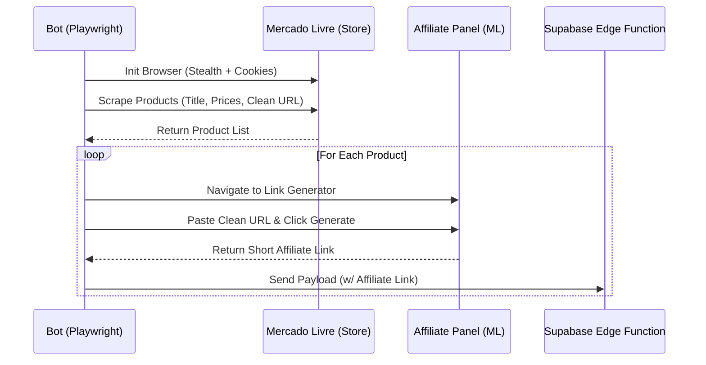

# Design: Bot Affiliate Session Injection

## Architecture
O script `cacador.ts` precisará ser refatorado para gerenciar o escopo do navegador com a injeção de estado.



## Contracts & Interfaces
O arquivo `cookies.json` é um array de objetos `Cookie`. Playwright espera o formato:
```typescript
interface Cookie {
  name: string;
  value: string;
  domain: string;
  path: string;
  expires: number;
  httpOnly: boolean;
  secure: boolean;
  sameSite: "Strict" | "Lax" | "None";
}
```
*Atenção:* A propriedade `expirationDate` fornecida na exportação do Chrome precisa ser mapeada ou traduzida (ou ignorada se o Playwright lidar bem com o dump padrão).

## Required Selectors (To be Clarified/Discovered)
O código exigirá o conhecimento de 3 seletores no painel de afiliados:
1. `URL_DO_PAINEL_DE_AFILIADOS`: A página exata do gerador.
2. `SELETOR_DO_INPUT_DE_URL`: O campo onde a URL orgânica é colada.
3. `SELETOR_DO_BOTAO_GERAR`: O botão de submissão.
4. `SELETOR_DO_RESULTADO_ENCURTADO`: O campo que exibe a URL final gerada.
